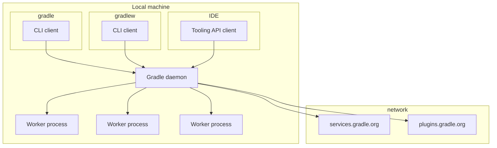

# Gradle runtimes

Gradle is made up of the following processes:

- Gradle daemon. This is the process where Gradle runs the build. It is a long-running daemon process.
- CLI client. This is the `gradle` or `gradlew` command, and is responsible for locating, starting and interacting with the Gradle daemon. 
- Tooling API client. This a library that is embedded into applications, such as IDEs or CI agents, that allows them to act as a Gradle client.
- Worker processes. Daemon processes that the Gradle starts to run specific kinds of work, such as compilation or test execution.
- https://services.gradle.org/. Provides information about Gradle releases and distributions.
- https://plugins.gradle.org/. The Gradle plugin portal.

These are all Java processes. All source core in Gradle is written to target one or more of these runtimes.
